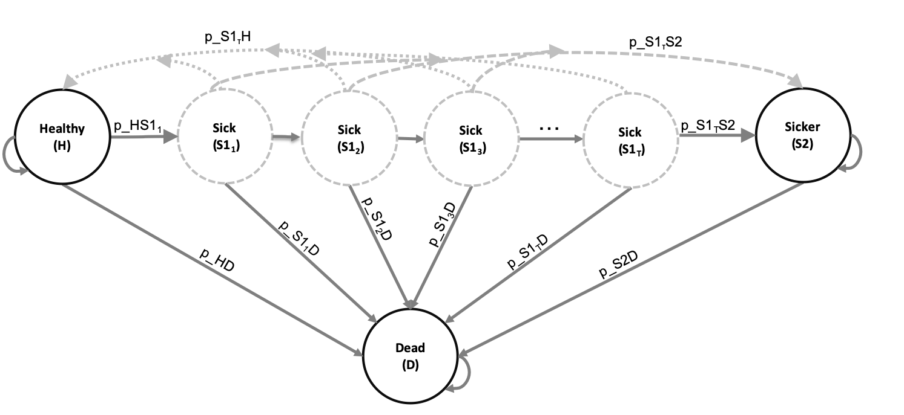
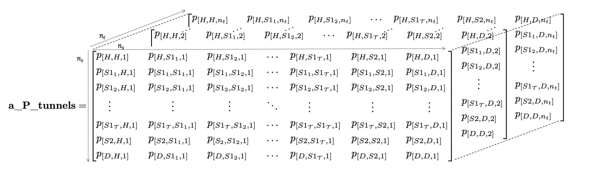

```{r, echo = FALSE}
## Journal Abbreviations
# library(RJSONIO)
# if(!file.exists("abbreviations.json")){
# download.file("https://ndownloader.figshare.com/files/5212423","wos_abbrev_table.csv")
#   abbrev <- read.csv("wos_abbrev_table.csv", sep = ";", header = TRUE, stringsAsFactors = FALSE)
#   abbrev$full <- gsub("\\", "\\\\",abbrev$full, fixed = TRUE)
#   abbrev.list <- list('default' = list('container-title' = abbrev$abbrev.dots))
#   names(abbrev.list$default$`container-title`) = abbrev$full
#   write(toJSON(abbrev.list), "abbreviations.json")
#   rm(abbrev)
#   rm(abbrev.list)
# }
```

```{r setup, include=FALSE}
#install.packages(c("kableExtra", "scales", "dampack"))
library(knitr)
library(kableExtra) # https://haozhu233.github.io/kableExtra/awesome_table_in_html.html
library(dplyr)
library(reshape2)
library(ggplot2)
library(patchwork)
library(scales) # For dollar signs and commas
library(dampack)
# devtools::install_github("DARTH-git/darthtools")
library(darthtools)
knitr::opts_chunk$set(echo = TRUE)
doc_type <- knitr::opts_knit$get('rmarkdown.pandoc.to')

# Load cSTM and CEA functions
source("../R/Functions_cSTM_time_dep_simulation.R")
source("../R/Functions.R")


# Define parameters
cycle_length <- 1 # cycle length equal to one year (use 1/12 for monthly)
n_age_init <- 25   # age at baseline
n_age_max  <- 100  # maximum age of follow up
n_cycles <- (n_age_max - n_age_init)/cycle_length # time horizon, number of cycles

## Age-dependent mortality rates
lt_usa_2005 <- read.csv("../data/LifeTable_USA_Mx_2015.csv")
#* Extract age-specific all-cause mortality for ages in model time horizon
v_r_mort_by_age <- lt_usa_2015 %>% 
  dplyr::filter(Age >= n_age_init & Age < n_age_max) %>%
  dplyr::select(Total) %>%
  as.matrix()
## Age-specific transition probabilities to the Dead state for all cycles
v_r_HDage  <- rep(v_r_mort_by_age, each = 1/cycle_length)
## Age-specific transition probabilities to the Dead state for all cycles adjusting by cycle length
v_p_HDage  <- 1 - exp(-v_r_HDage * cycle_length) 

## General setup
v_names_states <- c("H", "S1", "S2", "D") # the 4 health states of the model:
                               # Healthy (H), Sick (S1), Sicker (S2), Dead (D)
n_states <- length(v_names_states) # number of health states 
d_c <- 0.03 # annual discount rate for costs 
d_e <- 0.03 # annual discount rate for QALYs
v_names_str <- c("Standard of care", # store the strategy names
                 "Strategy A", 
                 "Strategy B",
                 "Strategy AB") 
n_str <- length(v_names_str)

## Transition probabilities (per cycle)
r_HS1  <- 0.15  # constant annual rate of becoming Sick when Healthy
r_S1H  <- 0.5   # constant annual rate of becoming Healthy when Sick
r_S1S2 <- 0.105 # constant annual rate of becoming Sicker when Sick
hr_S1  <- 3     # hazard ratio of death in Sick vs Healthy
hr_S2  <- 10    # hazard ratio of death in Sicker vs Healthy 

# Effectiveness of treatment B
hr_S1S2_trtB <- 0.6 # hazard ratio of becoming Sicker when Sick under treatment B

### Process model inputs
## Transition probability of becoming Sick when Healthy
# transform rate to probability
p_HS1   <- 1 - exp(-r_HS1 * cycle_length)
## Transition probability of becoming Healthy when Sick
# transform rate to probability
p_S1H   <- 1 - exp(-r_S1H * cycle_length)
## Transition probability of becoming Sicker when Sick
# transform rate to probability
p_S1S2  <- 1 - exp(-r_S1S2 * cycle_length)
## Annual transition probability of becoming Sicker when Sick for treatment B
# apply hazard ratio to rate to obtain transition rate of becoming Sicker when Sick for treatment B
r_S1S2_trtB <- r_S1S2 * hr_S1S2_trtB
# transform rate to probability
p_S1S2_trtB <- 1-exp(-r_S1S2_trtB * cycle_length) # probability to become Sicker when Sick 
                                                  # under treatment B conditional on surviving

## State rewards
# Costs
c_H    <- 2000  # cost of being Healthy for one cycle 
c_S1   <- 4000  # cost of being Sick for one cycle 
c_S2   <- 15000 # cost of being Sicker for one cycle
c_D    <- 0     # cost of being dead for one cycle
c_trtA <- 12000 # cost of treatment A for one cycle 
c_trtB <- 13000 # cost of treatment B for one cycle
# Utilities
u_H    <- 1     # utility of being Healthy for one cycle 
u_S1   <- 0.75  # utility of being Sick for one cycle 
u_S2   <- 0.5   # utility of being Sicker for one cycle
u_D    <- 0     # utility of being dead for one cycle
u_trtA <- 0.95  # utility when being treated for one cycle

# Transition rewards
du_HS1 <- 0.01  # disutility when transitioning from Healthy to Sick
ic_HS1 <- 1000  # increase in cost when transitioning from Healthy to Sick
ic_D   <- 2000  # increase in cost when dying

# PSA parameters
n_sim <- 1000 # Number of PSA samples
```

```{r figure-setup, echo=FALSE, include=FALSE}
## chunk will ensure that:
library(formatR)
# indent = 2: two spaces of indentation.
# tidy=TRUE puts formatR to work to produce a beautiful and standardized layout code.
if(!knitr:::is_html_output())
{
  # options("width"=56)
  knitr::opts_chunk$set(tidy.opts=list(indent = 1.5)) # width.cutoff=56, tidy = TRUE
  knitr::opts_chunk$set(fig.pos = 'H')
}

## chunk will ensure that:
# all the figures generated by the report will be placed in the figs/sub-directory
# all the figures will be 6.5 x 4 inches and centered in the text.
knitr::opts_chunk$set(fig.path="figs/", fig.width=8, fig.height=6, fig.align="center")
```

# Walkthough of R code
The R code below describes the initialization of the input parameters.

```{r Model-Params, eval=FALSE}
## General setup
cycle_length <- 1 # cycle length equal to one year (use 1/12 for monthly)
n_age_init <- 25  # age at baseline
n_age_max  <- 100 # maximum age of follow up
n_cycles <- (n_age_max - n_age_init)/cycle_length # time horizon, number of cycles
# The 4 health states of the model:
v_names_states <- c("H",  # Healthy (H)
                    "S1", # Sick (S1)
                    "S2", # Sicker (S2)
                    "D")  # Dead (D)
n_states <- length(v_names_states) # number of health states 
d_e <- 0.03 # discount rate for QALYs of 3% per cycle 
d_c <- 0.03 # discount rate for costs of 3% per cycle 
v_names_str <- c("Standard of care", # store the strategy names
                 "Strategy A", 
                 "Strategy B",
                 "Strategy AB") 

## Transition probabilities (per cycle), hazard ratios and odds ratio (OR)
r_HS1  <- 0.15  # constant annual rate of becoming Sick when Healthy
r_S1H  <- 0.5   # constant annual rate of becoming Healthy when Sick
r_S1S2 <- 0.105 # constant annual rate of becoming Sicker when Sick
hr_S1  <- 3     # hazard ratio of death in Sick vs Healthy
hr_S2  <- 10    # hazard ratio of death in Sicker vs Healthy 

### Process model inputs
## Constant transition probability of becoming Sick when Healthy
# transform rate to probability and scale by the cycle length
p_HS1 <- 1 - exp(-r_HS1 * cycle_length)
## Constant transition probability of becoming Healthy when Sick
# transform rate to probability and scale by the cycle length
p_S1H <- 1 - exp(-r_S1H * cycle_length)
## Constant transition probability of becoming Sicker when Sick
# transform rate to probability and scale by the cycle length
p_S1S2 <- 1 - exp(-r_S1S2 * cycle_length)

# Effectiveness of treatment B
hr_S1S2_trtB <- 0.6 # hazard ratio of becoming Sicker when Sick under treatment B

## State rewards
## Costs
c_H    <- 2000  # cost of being Healthy for one cycle 
c_S1   <- 4000  # cost of being Sick for one cycle 
c_S2   <- 15000 # cost of being Sicker for one cycle
c_D    <- 0     # cost of being dead for one cycle
c_trtA <- 12000 # cost of receiving treatment A for one cycle
c_trtB <- 13000 # cost of receiving treatment B for one cycle 
# Utilities
u_H    <- 1     # utility of being Healthy for one cycle 
u_S1   <- 0.75  # utility of being Sick for one cycle 
u_S2   <- 0.5   # utility of being Sicker for one cycle
u_D    <- 0     # utility of being dead for one cycle
u_trtA <- 0.95  # utility when receiving treatment A for one cycle

## Transition rewards
du_HS1 <- 0.01  # one-time utility decrement when transitioning from Healthy to Sick
ic_HS1 <- 1000  # one-time cost when transitioning from Healthy to Sick
ic_D   <- 2000  # one-time cost when dying
```

## Incorporating simulation-time dependency
Load and create age-specific all-cause mortality for ages in the model adjusnting for the number of cycles and cycle length.

```{r, eval=FALSE}
## Load life table mortality rates from `.csv` format
lt_usa_2005 <- read.csv("LifeTable_USA_Mx_2015.csv")
# Extract age-specific all-cause mortality for ages in model time horizon
v_r_mort_by_age <- lt_usa_2015 %>% 
  dplyr::filter(Age >= n_age_init & Age < n_age_max) %>%
  dplyr::select(Total) %>%
  as.matrix()
# Age-specific mortality rate in the Healthy state (background mortality) 
# for all cycles
v_r_HDage  <- rep(v_r_mort_by_age, each = 1/cycle_length)
# Transform to age-specific background mortality risk for all cycles adjusting 
# by cycle length
v_p_HDage  <- 1 - exp(-v_r_HDage * cycle_length) 
```


```{r}
## Age-specific mortality rates in the Sick and Sicker states
v_r_S1Dage <- v_r_HDage * hr_S1 # when Sick
v_r_S2Dage <- v_r_HDage * hr_S2 # when Sicker
## Age-specific probabilities of dying in the Sick and Sicker states
v_p_S1Dage <- 1 - exp(-v_r_S1Dage) # when Sick
v_p_S2Dage <- 1 - exp(-v_r_S2Dage) # when Sicker
```

To incorporate simulation-time dependency into the transition probability matrix, we expand the dimensions of the matrix and create a 3-dimensional transition probability array, $\mathbf{P}$ and named `a_P` in R, of dimensions $n_S \times n_S \times n_T$. The first two dimensions of this array correspond to transitions between states and the third dimension to time. The $t$-th element in the third dimension corresponds to the transition probability matrix at cycle $t$. A visual representation of `a_P` is shown in Figure \@ref(fig:Array-Time-Dependent).

```{r Array-Time-Dependent, echo=FALSE, out.width='100%', fig.cap="A 3-dimensional representation of the transition probability array of the Sick-Sicker model with simulation-time dependency.",fig.pos="H"}
knitr::include_graphics("figs/3D-state-transition-array-sick-sicker-without-tunnels.png")
```

First, we initialize the transition probability array for SoC, `a_P_SoC`, with a default value of zero for all transition probabilities.

```{r Init-Sick-Sicker-TimeDep-P}
# Initialize the transition probability array
a_P_SoC <- array(0, dim = c(n_states, n_states, n_cycles),
              dimnames = list(v_names_states, v_names_states, 0:(n_cycles - 1)))
```

Filling `a_P_SoC` with the corresponding transition probabilities of the cohort under the SoC strategy is comparable with filling a transition probability matrix for a time-independent cSTM. However, this requires a slight modification of the code from the time-independent cSTM. Accounting for the time dimension is represented by the third dimension of the array. The code below illustrates how to assign age-dependent transition probabilities in the third dimension of the array. For constant transitions over time, we only need to provide one value for the transition probability. R replicates the value of such transitions as many times as the number of cycles ($n_T+1$ times in our example). We create the transition probability array for strategy A as a copy of SoC's because treatment A does not alter the cohort's transition probabilities.

```{r Sick-Sicker-TimeDep-P}
### Fill in array
## From H
a_P_SoC["H", "H", ]   <- (1 - v_p_HDage) * (1 - p_HS1)
a_P_SoC["H", "S1", ]  <- (1 - v_p_HDage) * p_HS1
a_P_SoC["H", "D", ]   <- v_p_HDage
## From S1
a_P_SoC["S1", "H", ]  <- (1 - v_p_S1Dage) * p_S1H
a_P_SoC["S1", "S1", ] <- (1 - v_p_S1Dage) * (1 - (p_S1H + p_S1S2))
a_P_SoC["S1", "S2", ] <- (1 - v_p_S1Dage) * p_S1S2
a_P_SoC["S1", "D", ]  <- v_p_S1Dage
## From S2
a_P_SoC["S2", "S2", ] <- 1 - v_p_S2Dage
a_P_SoC["S2", "D", ]  <- v_p_S2Dage
## From D
a_P_SoC["D", "D", ]   <- 1

## Initialize transition probability matrix for strategy A as a copy of SoC's
a_P_strA <- a_P_SoC
```

As mentioned above, each slice along the third dimension of `a_P_SoC` corresponds to a transition probability matrix. For example, the transition matrix for 25-year-olds in the Sick-Sicker model under the SoC strategy can be retrieved by indexing the first slice of the array using:

```{r Transition-Probability-Array-1}
a_P_SoC[, , 1]
```

For strategy B, we first initialize the three-dimensional array of transition probabilities, `a_P_strB` as a copy of `a_P_SoC` and update only the probability of remaining in S1 and the transition probability from S1 to S2 (i.e., `p_S1S2` is replaced with `p_S1S2_trtB`). Because the transition probabilities are conditional on surviving and mortality from S1 is age-dependent, the transition probability from S1 to S2 will change in each cycle. Next, we create the transition probability array for strategy AB, `a_P_strAB`, as a copy of `a_P_strB` since the cSTMs for strategies B and AB have identical transition probabilities. 

```{r Sick-Sicker-Time-Dependent-Age-New-Treatment2}
## Initialize transition probability array for strategy B
a_P_strB <- a_P_SoC
## Update only transition probabilities from S1 involving p_S1S2
a_P_strB["S1", "S1", ] <- (1 - v_p_S1Dage) * (1 - (p_S1H + p_S1S2_trtB))
a_P_strB["S1", "S2", ] <- (1 - v_p_S1Dage) * p_S1S2_trtB

## Initialize transition probability matrix for strategy AB as a copy of B's
a_P_strAB <- a_P_strB
```

We used the functions `check_sum_of_transition_array` and `check_transition_probability` in the `darthtools` package (https://github.com/DARTH-git/darthtools) for checking the transition probability arrays are valid (i.e., ensuring transition probabilities are between 0 and 1, and transition probabilities from each state sum to 1).

```{r, echo=FALSE}
### Check if transition probability matrices are valid
## Check that transition probabilities are [0, 1]
check_transition_probability(a_P_SoC)
check_transition_probability(a_P_strA)
check_transition_probability(a_P_strB)
check_transition_probability(a_P_strAB)
## Check that all rows sum to 1
check_sum_of_transition_array(a_P_SoC, n_states = n_states, n_cycles = n_cycles)
check_sum_of_transition_array(a_P_strA, n_states = n_states, n_cycles = n_cycles)
check_sum_of_transition_array(a_P_strB, n_states = n_states, n_cycles = n_cycles)
check_sum_of_transition_array(a_P_strAB, n_states = n_states, n_cycles = n_cycles)
```

In the Sick-Sicker model, the entire cohort starts in the Healthy state. Therefore, we create the $1 \times n_S$ initial state vector `v_m_init` with all of the cohort assigned to the H state:
```{r Sick-Sicker-s0, eval=TRUE, results='hide'}
v_m_init <- c(H = 1, S1 = 0, S2 = 0, D = 0) # initial state vector
v_m_init
#  H S1 S2  D 
#  1  0  0  0
```

We use the variable `v_m_init` to initialize the cohort trace, $M$, represented by `m_M` for the cohort under SoC strategy. We also create a trace for each of the other treatment-based strategies. Note that the initial state vector, `v_m_init`, can be modified to account for the distribution of the cohort across the states at the start of the simulation and might vary by strategy. To simulate the cohort over the $n_T$ cycles for the simulation-time-dependent cSTM, we initialize four cohort trace matrices, one for each strategy.

```{r Init-Sick-Sicker-TimeDependent-Trace}
## Initialize cohort trace for age-dependent cSTM under SoC
m_M_SoC <- matrix(NA, 
                 nrow = (n_cycles + 1), ncol = n_states, 
                 dimnames = list(0:n_cycles, v_names_states))
# Store the initial state vector in the first row of the cohort trace
m_M_SoC[1, ] <- v_m_init
## Initialize cohort trace for strategies A, B, and AB
# Structure and initial states are the same as for SoC
m_M_strA  <- m_M_SoC # Strategy A
m_M_strB  <- m_M_SoC # Strategy B
m_M_strAB <- m_M_SoC # Strategy AB
```

We then use the matrix product to get the state vector of the cohort's distribution at each cycle $t$. This equation is similar to the one described for the time-independent model. The only modification required is to index the transition probability arrays by $t$ to obtain each strategy's cycle-specific transition probability matrices.

```{r Sick-Sicker-TimeDependent-Solution}
# Iterative solution of age-dependent cSTM
for(t in 1:n_cycles){
  # For SoC
  m_M_SoC[t + 1, ] <- m_M_SoC[t, ] %*% a_P_SoC[, , t]
  # For strategy A
  m_M_strA[t + 1, ] <- m_M_strA[t, ] %*% a_P_strA[, , t]
  # For strategy B
  m_M_strB[t + 1, ] <- m_M_strB[t, ] %*% a_P_strB[, , t]
  # For strategy AB
  m_M_strAB[t + 1, ] <- m_M_strAB[t, ] %*% a_P_strAB[, , t]
}
```

A graphical representation of the cohort trace for all cycles of the age-dependent cSTM under SoC is shown in Figure \@ref(fig:Sick-Sicker-Trace-AgeDep).

```{r Sick-Sicker-Trace-AgeDep, echo=FALSE, fig.cap='Cohort trace of the age-dependent cSTM under SoC.', message=FALSE, warning=FALSE, fig.pos="H"} 
cols <- get_DARTH_cols()
lty <-  c("H" = 1, "S1" = 2, "S2" = 4, "D" = 3)
ggplot(melt(m_M_SoC), aes(x = Var1, y = value, 
                         color = Var2, linetype = Var2)) +
  geom_line(size = 1) +
  scale_color_manual(name = "Health state", values = cols) +
  scale_linetype_manual(name = "Health state", values = lty) +
  scale_x_continuous(breaks = number_ticks(8)) +
  xlab("Cycle") +
  ylab("Proportion of the cohort") +
  theme_bw(base_size = 16) +
  theme(legend.position = "bottom", 
        legend.background = element_rect(fill = NA))
```

## Incorporating time dependency on state residence
Here, we add the dependency on state-residence to the simulation-time-dependent Sick-Sicker model defined above. We assume the risk of progression from S1 to S2 increases as a function of the time $\tau = 1, \ldots, n_{\text{tunnels}}$ the cohort remains in the S1 state. This increase follows a Weibull hazard function, $h(\tau)$, defined as
$$
  h(\tau) = \gamma \lambda (\lambda \tau)^{\gamma-1},
$$
with a corresponding cumulative hazard, $H(\tau)$,
\begin{equation}
  H(\tau) = (\lambda \tau)^{\gamma},
(\#eq:H-weibull)
\end{equation}
where $\lambda$ and $\gamma$ are the scale and shape parameters of the Weibull hazard function, respectively.

To derive a transition probability from S1 to S2 as a function of the time the cohort spends in S1, $p_{\left[S1_{\tau},S2, \tau\right]}$, we assume constant rates within each cycle interval (i.e., piecewise exponential transition times), where the cycle-specific probability of a transition is 
\begin{equation}
  p_{\left[S1_{\tau},S2, \tau\right]} = 1-\exp{\left(-\mu_{\left[S1_{\tau},S2, \tau\right]}\right)},
(\#eq:tp-from-rate)
\end{equation}
where $\mu_{\left[S1_{\tau},S2, \tau\right]}$ is the rate of transition from S1 to S2 in cycle $\tau$ defined as the difference in cumulative hazards between consecutive cycles[@Diaby2014]
\begin{equation}
  \mu_{\left[S1_{\tau},S2, \tau\right]} = H(\tau) - H(\tau-1).
(\#eq:tr-from-H)
\end{equation}

Substituting the Weibull cumulative hazard from Equation \@ref(eq:H-weibull) into Equation \@ref(eq:tr-from-H) gives
\begin{equation}
  \mu_{\left[S1_{\tau},S2, \tau\right]} = (\lambda \tau)^{\gamma} - (\lambda (\tau-1))^{\gamma},
(\#eq:tr-from-H-weibull)
\end{equation}
and the transition probability
\begin{equation}
  p_{\left[S1_{\tau},S2, \tau\right]} = 1-\exp{\left(- \left((\lambda \tau)^{\gamma} - (\lambda (\tau-1))^{\gamma}\right) \right)}.
(\#eq:tp-from-H-weibull)
\end{equation}

We assume that state-residence dependency affects the cohort in the S1 state throughout the whole simulation (i.e., $n_{\text{tunnels}}=n_T$) and create a new variable called `n_tunnel_size` with the length of the tunnel equal to `n_cycles`. Thus, there will be `r n_cycles` S1 tunnel states plus `r (n_states-1)` more states (H, S2, D) resulting in a total of $n_{S_{\text{tunnels}}}$ = `r (n_states-1) + n_cycles`.

Figure \@ref(fig:STD-Sick-Sicker-tunnels) shows the Sick-Sicker model's state-transition diagram with state-residence dependency with $n_{\text{tunnels}}$ tunnel states for S1.
 
```{r STD-Sick-Sicker-tunnels, echo=FALSE, out.width='100%', fig.cap="State-transition diagram of the Sick-Sicker model with tunnel states expanding the Sick state ($S1_1, S1_2,...,S1_{n_{\\text{tunnels}}}$).", fig.pos="H"}

```

To implement state-residence dependency in the Sick-Sicker cSTM, we create the vector variables `v_Sick_tunnel` and `v_names_states_tunnels` with the names of the  Sick tunnel states' and all the states of the cSTM, including tunnels, respectively, and use the parameters listed in Table \@ref(tab:Timedep-cSTM-components-table).

```{r}
## Number of tunnels
n_tunnel_size <- n_cycles 
## Vector with cycles for tunnels
v_cycles_tunnel <- 1:n_tunnel_size
## Vector with the names of the Sick tunnel state
v_Sick_tunnel <- paste("S1_", seq(1, n_tunnel_size), "Yr", sep = "")
## Create variables for model with tunnels
v_names_states_tunnels <- c("H", v_Sick_tunnel, "S2", "D") # state names
n_states_tunnels <- length(v_names_states_tunnels)         # number of states
## Initialize first cycle of Markov trace accounting for the tunnels
v_m_init_tunnels <- c(1, rep(0, n_tunnel_size), 0, 0) 
```

Then, the transition rate and probability dependent on state residence from Sick to Sicker, `v_r_S1S2_tunnels` and `v_p_S1S2_tunnels`, respectively, based on a Weibull hazard function are: 
```{r}
# Weibull parameters
p_S1S2_scale <- 0.08 # scale
p_S1S2_shape <- 1.10 # shape
# Weibull function
v_r_S1S2_tunnels <- (v_cycles_tunnel*p_S1S2_scale)^p_S1S2_shape -
                    ((v_cycles_tunnel-1)*p_S1S2_scale)^p_S1S2_shape
                    
v_p_S1S2_tunnels <- 1 - exp(-v_r_S1S2_tunnels*cycle_length)
```

To adapt the 3-dimensional transition probability array to incorporate both age and state-residence dependency in the Sick-Sicker model under SoC, we first create an expanded 3-dimensional array accounting for tunnels, `a_P_tunnels_SoC`. The dimensions of this array are $n_{S_{\text{tunnels}}} \times n_{S_{\text{tunnels}}} \times n_T$. A visual representation of `a_P_tunnels_SoC` of the Sick-Sicker model with tunnel states expanding the Sick state is shown in Figure \@ref(fig:Array-Time-Dependent-Tunnels).

```{r Init-Sick-Sicker-TimeDep-P-tunnels}
# Initialize array
a_P_tunnels_SoC <- array(0, dim = c(n_states_tunnels, n_states_tunnels, n_cycles),
                         dimnames = list(v_names_states_tunnels, 
                                         v_names_states_tunnels, 
                                         0:(n_cycles - 1)))
```

```{r Array-Time-Dependent-Tunnels, echo=FALSE, out.width='100%', fig.cap="The 3-dimensional transition probability array of the Sick-Sicker model expanded to account for simulation-time and state-residence dependency using $\\tau$ tunnel states for S1.", fig.pos="H"}

```

Filling `a_P_tunnels_SoC` with the corresponding transition probabilities is similar to how it's done with `a_P_SoC` above, with the difference being that we now fill the transition probabilities from all the tunnel states by iterating through all the tunnel states and assigning the corresponding disease progression transition probabilities for each tunnel state.

```{r Sick-Sicker-TimeDep-P-tunnels}
### Fill in array
## From H
a_P_tunnels_SoC["H", "H", ]              <- (1 - v_p_HDage) * (1 - p_HS1)
a_P_tunnels_SoC["H", v_Sick_tunnel[1], ] <- (1 - v_p_HDage) * p_HS1
a_P_tunnels_SoC["H", "D", ]              <- v_p_HDage
## From S1
for(i in 1:(n_tunnel_size - 1)){
  a_P_tunnels_SoC[v_Sick_tunnel[i], "H", ]  <- (1 - v_p_S1Dage) * p_S1H
  a_P_tunnels_SoC[v_Sick_tunnel[i], 
                  v_Sick_tunnel[i + 1], ]   <- (1 - v_p_S1Dage) *
                                               (1 - (p_S1H + v_p_S1S2_tunnels[i]))
  a_P_tunnels_SoC[v_Sick_tunnel[i], "S2", ] <- (1 - v_p_S1Dage) * v_p_S1S2_tunnels[i]
  a_P_tunnels_SoC[v_Sick_tunnel[i], "D", ]  <- v_p_S1Dage
}
# Repeat code for the last cycle to force the cohort stay in the last tunnel state of Sick
a_P_tunnels_SoC[v_Sick_tunnel[n_tunnel_size], "H", ]  <- (1 - v_p_S1Dage) * p_S1H
a_P_tunnels_SoC[v_Sick_tunnel[n_tunnel_size],
                v_Sick_tunnel[n_tunnel_size], ] <- (1 - v_p_S1Dage) *
                                                   (1 - (p_S1H + v_p_S1S2_tunnels[n_tunnel_size]))
a_P_tunnels_SoC[v_Sick_tunnel[n_tunnel_size], "S2", ] <- (1 - v_p_S1Dage) * 
                                                     v_p_S1S2_tunnels[n_tunnel_size]
a_P_tunnels_SoC[v_Sick_tunnel[n_tunnel_size], "D", ]  <- v_p_S1Dage
### From S2
a_P_tunnels_SoC["S2", "S2", ] <- 1 - v_p_S2Dage
a_P_tunnels_SoC["S2", "D", ]  <- v_p_S2Dage
# From D
a_P_tunnels_SoC["D", "D", ] <- 1
```

<!-- To account for the effectiveness of treatment B on the progression from the S1 to the S2 state, we multiply the treatment's hazard ratio, `hr_S1S2_trtB`, by the difference of the cumulative hazards in Equation \@ref(eq:tp-from-H-weibull) -->

<!-- ```{r} -->
<!-- # Weibull function -->
<!-- v_p_S1S2_tunnels_trtB <- 1-exp((((v_cycles_tunnel-1)*p_S1S2_scale)^p_S1S2_shape -  -->
<!--                                  (v_cycles_tunnel*p_S1S2_scale)^p_S1S2_shape) *  -->
<!--                                  hr_S1S2_trtB) -->
<!-- ``` -->

Next, we create the transition probability array for Strategy B. To implement the effectiveness of treatment B, we multiply the vector of transition rates, `v_r_S1S2_tunnels`, by the hazard ratio of treatment B, `hr_S1S2_trtB`. Then, we transform to a vector of transition probabilities that account for the duration of S1 state-residence under treatment B, `v_p_S1S2_tunnels_trtB`, following Equation \@ref(eq:tp-from-rate).

```{r}
# Apply hazard ratio to rate to obtain transition rate of becoming Sicker when 
# Sick for treatment B
v_r_S1S2_tunnels_trtB <- v_r_S1S2_tunnels * hr_S1S2_trtB
# transform rate to probability to become Sicker when Sick under treatment B 
# conditional on surviving
v_p_S1S2_tunnels_trtB <- 1 - exp(-v_r_S1S2_tunnels_trtB*cycle_length) 
```

Then, we initialize the three-dimensional transition probability array for treatment B, `a_P_tunnels_trtB`, based on `a_P_tunnels_SoC`. The only difference here is that we update the transition probabilities from S1 involving `v_p_S1S2_tunnels` to `v_p_S1S2_tunnels_trtB` instead.

```{r Sick-Sicker-Time-Dependent-State-Residence-New-Treatment2}
## Initialize transition probability array for treatment B
a_P_tunnels_trtB <- a_P_tunnels_SoC
## Update only transition probabilities from S1 involving v_p_S1S2_tunnels
for(i in 1:(n_tunnel_size - 1)){
  a_P_tunnels_trtB[v_Sick_tunnel[i], "H", ] <- (1 - v_p_S1Dage) * p_S1H
  a_P_tunnels_trtB[v_Sick_tunnel[i], 
              v_Sick_tunnel[i + 1], ] <- (1 - v_p_S1Dage) * 
                                         (1 - (p_S1H + v_p_S1S2_tunnels_trtB[i]))
  a_P_tunnels_trtB[v_Sick_tunnel[i], "S2", ] <- (1 - v_p_S1Dage) * v_p_S1S2_tunnels_trtB[i]
  a_P_tunnels_trtB[v_Sick_tunnel[i], "D", ]  <- v_p_S1Dage
}
# repeat code for the last cycle to force the cohort stay in the last tunnel state of Sick
a_P_tunnels_trtB[v_Sick_tunnel[n_tunnel_size], "H", ] <- (1 - v_p_S1Dage) * p_S1H
a_P_tunnels_trtB[v_Sick_tunnel[n_tunnel_size],
            v_Sick_tunnel[n_tunnel_size], ] <- (1 - v_p_S1Dage) * 
                                               (1 - (p_S1H +v_p_S1S2_tunnels_trtB[n_tunnel_size]))
a_P_tunnels_trtB[v_Sick_tunnel[n_tunnel_size], "S2", ] <- (1 - v_p_S1Dage) *
                                                           v_p_S1S2_tunnels_trtB[n_tunnel_size]
a_P_tunnels_trtB[v_Sick_tunnel[n_tunnel_size], "D", ]  <- v_p_S1Dage
```

Once we create both three-dimensional transition probability arrays with tunnels, we check they are valid (i.e., between 0 and 1 and transition probabilities from each state sum to 1).

```{r}
### Check if transition probability matrices are valid
## Check that transition probabilities are [0, 1]
check_transition_probability(a_P_tunnels_SoC)
check_transition_probability(a_P_tunnels_trtB)
## Check that all rows sum to 1
check_sum_of_transition_array(a_P_tunnels_SoC, n_states = n_states_tunnels, 
                              n_cycles = n_cycles)
check_sum_of_transition_array(a_P_tunnels_trtB, n_states = n_states_tunnels, 
                              n_cycles = n_cycles)
```

To simulate the cohort and store its state occupation over the $n_T$ cycles for the cSTM accounting for state-residence dependency, we initialize two new cohort trace matrices for the SoC and treatment B, `m_M_tunnels_SoC` and `m_M_tunnels_trtB`, respectively. The dimensions of both matrices are $(n_T+1) \times n_{S_{\text{tunnels}}}$.

```{r Init-Sick-Sicker-TimeDependent-Tunnels-Trace}
# Initialize cohort for state-residence cSTM under SoC
m_M_tunnels_SoC <- matrix(0, 
                      nrow = (n_cycles + 1), ncol = n_states_tunnels, 
                      dimnames = list(0:n_cycles, v_names_states_tunnels))
# Store the initial state vector in the first row of the cohort trace
m_M_tunnels_SoC[1, ] <- v_m_init_tunnels
## Initialize cohort trace under treatment B
m_M_tunnels_trtB <- m_M_tunnels_SoC
```

We then use the matrix product, similar to the simulation-time-dependent cSTM, to generate the full cohort trace.

```{r Sick-Sicker-TimeDependent-Tunnels-Solution}
# Iterative solution of state-residence-dependent cSTM
for(t in 1:n_cycles){
  # For SoC
  m_M_tunnels_SoC[t + 1, ] <- m_M_tunnels_SoC[t, ] %*% a_P_tunnels_SoC[, , t]
  # Under treatment B
  m_M_tunnels_trtB[t + 1,] <- m_M_tunnels_trtB[t, ] %*% a_P_tunnels_trtB[, , t]
}
```

To compute a summarized cohort trace to capture occupancy in the H, S1, S2, D states under SoC, we aggregate over the tunnel states in each cycle(Figure \@ref(fig:Sick-Sicker-Trace-HistDep)).

```{r}
# Create aggregated trace
m_M_tunnels_SoC_sum <- cbind(H = m_M_tunnels_SoC[, "H"], 
                             S1 = rowSums(m_M_tunnels_SoC[, which(v_names_states=="S1"):
                                                        (n_tunnel_size +1)]), 
                             S2 = m_M_tunnels_SoC[, "S2"],
                             D = m_M_tunnels_SoC[, "D"])
```

```{r Sick-Sicker-Trace-HistDep, echo=FALSE, fig.cap='Cohort trace of the age-dependent cSTM accounting for state-residence dependency under SoC.', message=FALSE, warning=FALSE, fig.pos="H"} 
cols <- get_DARTH_cols()
lty <-  c("H" = 1, "S1" = 2, "S2" = 4, "D" = 3)
ggplot(melt(m_M_tunnels_SoC_sum), aes(x = Var1, y = value, 
                         color = Var2, linetype = Var2)) +
  geom_line(size = 1) +
  scale_color_manual(name = "Health state", values = cols) +
  scale_linetype_manual(name = "Health state", values = lty) +
  scale_x_continuous(breaks = number_ticks(8)) +
  xlab("Cycle") +
  ylab("Proportion of the cohort") +
  theme_bw(base_size = 16) +
  theme(legend.position = "bottom", 
        legend.background = element_rect(fill = NA))
```
# Epidemiological and economic measures
cSTMs can be used to generate different epidemiological and economic outputs. In a CEA, the main outcomes are typically the total discounted expected QALYs and total costs accrued by the cohort over the predefined time horizon. However, epidemiological outcomes can be helpful for calibration and validation. Some common epidemiological outcomes include survival, prevalence, incidence, the average number of events, and lifetime risk of events.[@Siebert2012c] We show how to obtain some of these outcomes from the trace and transition probability objects.

## Epidemiological measures
We provide the epidemiological definition of some of these outcomes and how they can be generated from a cSTM using the simulation time-dependent Sick-Sicker cSTM under SoC. In the GitHub repository, we provide the code to generate these outcomes from the state-residence-dependent cSTM.

### Survival probability
The survival probability, $S(t)$, captures the proportion of the cohort remaining alive by cycle $t$. To estimate $S(t)$ from the simulated cohort of the simulation-time-dependent Sick-Sicker model, shown in Figure \@ref(fig:Sick-Sicker-Surv-AgeDep), we sum the proportions of the non-death states for all $n_T$ cycles in `m_M_SoC`.

```{r Sick-Sicker-TimeDependent-Surv}
v_S_SoC <- rowSums(m_M_SoC[, -which(v_names_states == "D")]) # vector with survival curve
``` 

```{r Sick-Sicker-Surv-AgeDep, echo=FALSE, fig.cap='Survival curve of the age-dependent cSTM', message=FALSE, warning=FALSE, fig.pos="H"} 
ggplot(data.frame(Cycle = 0:n_cycles, Survival = v_S_SoC), 
       aes(x = Cycle, y = Survival)) +
  geom_line(size = 1.3) +
  scale_x_continuous(breaks = number_ticks(8)) + 
  xlab("Cycle") +
  ylab("Proportion alive") +
  theme_bw(base_size = 16) +
  theme()
```

### Life expectancy
Life expectancy (LE) refers to the expected number of time units remaining to be alive.[@Lee2003a] In continuous-time, LE is the area under the entire survival curve.[@Klein2003]

$$
LE = \int_{t=0}^{\infty}{S(t) dt}.
$$

In discrete-time using cSTMs, we often calculate restricted LE over a fixed time horizon (e.g., $n_T$) at which most of the cohort has transitioned to the Dead state and is defined as

$$
  LE = \sum_{t=0}^{n_T}{S(t)}.
$$

```{r Expected-life-years-NoShow, echo=FALSE}
le_SoC <- sum(v_S_SoC)
```

In the simulation-time-dependent Sick-Sicker model, where we simulated a cohort over  $n_T$= `r n_cycles` cycles, life expectancy `le_SoC` is `r round(le_SoC, 1)` cycles, which is calculated as

```{r Life-expectancy, eval=FALSE}
le_SoC <- sum(v_S_SoC) # life expectancy
```

Note that this equation expresses LE in the units of $t$. We use an annual cycle length; thus, the resulting LE will be in years. Analysts can also use other cycle lengths (e.g., monthly or daily), but the LE must be correctly converted to the desired unit if different than the cycle length units.

### Prevalence
Prevalence is defined as the proportion of the population or cohort with a specific condition (or being in a particular health state) among those alive.[@Rothman2008h] To calculate the prevalence of S1 at cycle $t$, $\text{prev}(t)_i$, we compute the ratio between the proportion of the cohort in S1 and the proportion alive at that cycle.[@Keiding1991] The proportion of the cohort alive is given by the survival probability $S(t)$ defined above. The individual prevalence of the S1 and S2 health states and the overall prevalence of sick individuals (i.e., S1 + S2) of the age-dependent Sick-Sicker cSTM at each cycle $t$ is computed as follows and are shown in Figure \@ref(fig:Sick-Sicker-Prev-AgeDep).

```{r Sick-Sicker-TimeDependent-Prevalence}
v_prev_S1_SoC   <- m_M_SoC[, "S1"] / v_S_SoC          # vector with prevalence of Sick
v_prev_S2_SoC   <- m_M_SoC[, "S2"] / v_S_SoC          # vector with prevalence of Sicker
v_prev_S1S2_SoC <- rowSums(m_M_SoC[, c("S1", "S2")])/v_S_SoC # prevalence of Sick and Sicker
```

```{r Sick-Sicker-Prev-AgeDep, echo=FALSE, fig.cap='Prevalence of sick states in age-dependent cSTM', message=FALSE, warning=FALSE, fig.pos="H"} 
df_prev_states <- data.frame(Cycle = 0:n_cycles, 
                  States  = ordered(rep(c("S1", "S2", "S1 + S2"),
                                each = (n_cycles + 1)), 
                                levels = c("S1", "S2", "S1 + S2")), 
                  Prevalence = c(v_prev_S1_SoC, 
                                 v_prev_S2_SoC, 
                                 v_prev_S1S2_SoC))
ggplot(df_prev_states, 
       aes(x = Cycle, y = Prevalence, 
           color = States, linetype = States)) +
  geom_line(size = 1) +
  scale_x_continuous(breaks = number_ticks(8)) + 
  scale_y_continuous(labels = scales::percent_format(accuracy = 1)) + 
  scale_color_discrete(name = "Health State", l = 50) +
  scale_linetype(name = "Health State") +
  xlab("Cycle") +
  ylab("Prevalence (%)") +
  theme_bw(base_size = 16) +
  theme(legend.position = "bottom")
```

## Economic measures
In CEA, we can calculate economic outcomes from state and transition rewards. A "state reward" refers to a value (e.g., cost, utility) assigned to individuals for remaining in a given health state for one cycle. A "transition reward" refers to the increase or decrease in either costs or utilities of transitioning from one health state to another, which may be associated with a one-time cost or utility impact. In the accompanying tutorial, we describe how to incorporate state rewards in CEA in detail.[@Alarid-Escudero2021a] Here, we describe and illustrate how to implement both state and transition rewards together using a transition array.

### State rewards
As shown in the introductory tutorial, to add state rewards to the Sick-Sicker model, we first create a vector of utilities and costs for each of the four strategies considered. The vectors of utilities and costs, `v_u_SoC` and `v_c_SoC`, respectively, contain the utilities and costs corresponding to being in each of the four health states under SoC, shown in Table \@ref(tab:param-table).

```{r State-rewards-UC}
# Vector of state utilities under SoC
v_u_SoC <- c(H = u_H, S1 = u_S1, S2 = u_S2, D = u_D)
# Vector of state costs under SoC
v_c_SoC <- c(H = c_H, S1 = c_S1, S2 = c_S2, D = c_D)
```

We account for the benefits and costs of both treatments individually and their combination to create the state-reward vectors under treatments A and B (strategies A and B, respectively) and when applied jointly (strategy AB). Only treatment A affects QoL, so we create a vector of utilities for strategy A, `v_u_strA`, where we substitute the utility of being in S1 under SoC, `u_S1`, with the utility associated with the benefit of treatment A in being in that state, `u_trtA`. Treatment B does not affect QoL, so the vector of utilities for strategy B, `v_u_strB`, is the same as SoC's vector. However, when both treatments A and B are applied jointly (strategy AB), the resulting vector of utilities `v_u_strAB` equals that of strategy A.

```{r State-rewards-U-Tr}
# Vector of state utilities for strategy A
v_u_strA <- c(H = u_H, S1 = u_trtA, S2 = u_S2, D = u_D)
# Vector of state utilities for strategy B
v_u_strB <- v_u_SoC
# Vector of state utilities for strategy AB
v_u_strAB <- v_u_strA
```

Both treatments A and B incur a cost. To create the vector of state costs for strategy A, `v_c_strA`, we add the cost of treatment A, `c_trtA`, to S1 and S2 state costs. Similarly, when constructing the vector of state costs for strategy B, `v_c_strB`, we add the cost of treatment B, `c_trtB`, to S1 and S2 state costs. Finally, for the vector of state costs for strategy AB, `v_c_strAB`, we add both treatment costs to the state costs of S1 and S2.

```{r State-rewards-C-Tr}
# Vector of state costs for strategy A
v_c_strA <- c(H  = c_H, 
              S1 = c_S1 + c_trtA, 
              S2 = c_S2 + c_trtA, 
              D  = c_D)
# Vector of state costs for strategy B
v_c_strB <- c(H  = c_H, 
              S1 = c_S1 + c_trtB, 
              S2 = c_S2 + c_trtB, 
              D  = c_D)
# Vector of state costs for strategy AB
v_c_strAB <- c(H  = c_H, 
               S1 = c_S1 + (c_trtA + c_trtB), 
               S2 = c_S2 + (c_trtA + c_trtB), 
               D  = c_D)
```

### Transition rewards
As previously mentioned, dying (i.e., transitioning to the Dead state) incurs a one-time cost of `r dollar(ic_D)` that reflects the acute care that might be received immediately preceding death. We also have a disutility and a cost increment on the transition from H to S1. Incorporating transition rewards requires keeping track of the proportion of the cohort that transitions between health states in each cycle while capturing the origin and destination states for each transition. The cohort trace, $M$, does not capture this information. However, obtaining this information is relatively straightforward in a cSTM and described in detail by Krijkamp et al. (2020).[@Krijkamp2019] Briefly, this approach involves changing the core computation in a traditional cSTM, from $m_t P_t$ to $\text{diag}(m_t) P_t$. This simple change allows us to compute the proportion of the cohort that transitions between any two states in a cycle $t$. The result is no longer a cohort trace matrix, but rather a three-dimensional array that we refer to as a transition-dynamics array ($\mathbf{A}$) with dimensions \(n_S \times n_S \times [n_T+1]\). The $t-$th slice of $\mathbf{A}$, $A_t$, is the matrix that stores the proportion of the population that transitioned between any two states from cycles $t-1$ to $t$. Similarly, we define the transition rewards by the states of origin and destination.

To account for both state and transition rewards, we create a *matrix* of rewards $R_t$ of dimensions $n_S \times n_S$. The off-diagonal entries of $R_t$ store the transition rewards, and the diagonal of $R_t$ stores the state rewards for cycle $t$ and assumes that rewards occur at the beginning of the cycle.[@Krijkamp2019] Finally, we multiply this matrix by $A_t$, the $t$-th slice of $A$, and apply discounting, within-cycle correction, and compute the overall reward for each strategy outcome. Below, we illustrate these computations in R.

To compute $\mathbf{A}$ for the simulation-time-dependent Sick-Sicker model under SoC, we initialize a three-dimensional array `a_A_SoC` of dimensions $n_S \times n_S \times [n_T+1]$ and set the diagonal of the first slice to the initial state vector `v_m_init`. Next, we create a three-dimensional array for each of the strategies as a copy of the array under SoC.

```{r Init-Transition-Array}
# Initialize transition-dynamics array under SoC
a_A_SoC <- array(0,
             dim = c(n_states, n_states, (n_cycles + 1)),
             dimnames = list(v_names_states, v_names_states, 0:n_cycles))
# Set first slice to the initial state vector in its diagonal
diag(a_A_SoC[, , 1]) <- v_m_init
# Initialize transition-dynamics array for strategies A, B, and AB
# Structure and initial states are the same as for SoC
a_A_strA  <- a_A_SoC
a_A_strB  <- a_A_SoC
a_A_strAB <- a_A_SoC
```

We then compute a matrix multiplication between a diagonal matrix of each of the $t$-th rows of the cohort trace matrix under SoC and treatment B, denoted as `diag(m_M_SoC[t, ])` and `diag(m_M_strB[t, ])`, by the $t$-th matrix of the array of transition matrices, `a_P_SoC[, , t]` and `a_P_strB[, , t]`, respectively,  over all $n_T$ cycles.

```{r Compute-Transition-Array}
# Iterative solution to produce the transition-dynamics array
for (t in 1:n_cycles){
  # For SoC
  a_A_SoC[, , t + 1] <- diag(m_M_SoC[t, ]) %*% a_P_SoC[, , t]
  # For strategy A
  a_A_strA[, , t + 1] <- diag(m_M_strA[t, ]) %*% a_P_strA[, , t]
  # For strategy B
  a_A_strB[, , t + 1] <- diag(m_M_strB[t, ]) %*% a_P_strB[, , t]
  # For strategy AB
  a_A_strAB[, , t + 1] <- diag(m_M_strAB[t, ]) %*% a_P_strAB[, , t]
}
```

To create the arrays of rewards for costs and utilities for the simulation-time-dependent Sick-Sicker cSTM, we create strategy-specific three-dimensional arrays of rewards and fill each of their rows across the third dimension with the vector of state rewards.

```{r Init-Reward-Array}
# Arrays of state and transition rewards
# Utilities under SoC
a_R_u_SoC <- array(matrix(v_u_SoC, nrow = n_states, ncol = n_states, byrow = T), 
                  dim = c(n_states, n_states, n_cycles + 1),
                  dimnames = list(v_names_states, v_names_states, 0:n_cycles))
# Costs under SoC
a_R_c_SoC <- array(matrix(v_c_SoC, nrow = n_states, ncol = n_states, byrow = T), 
                  dim = c(n_states, n_states, n_cycles + 1),
                  dimnames = list(v_names_states, v_names_states, 0:n_cycles))
# Utilities under Strategy A
a_R_u_strA <-  array(matrix(v_u_strA, nrow = n_states, ncol = n_states, byrow = T), 
                  dim = c(n_states, n_states, n_cycles + 1),
                  dimnames = list(v_names_states, v_names_states, 0:n_cycles))
# Costs under Strategy A
a_R_c_strA <- array(matrix(v_c_strA, nrow = n_states, ncol = n_states, byrow = T), 
                  dim = c(n_states, n_states, n_cycles + 1),
                  dimnames = list(v_names_states, v_names_states, 0:n_cycles))
# Utilities under Strategy B
a_R_u_strB <-  array(matrix(v_u_strB, nrow = n_states, ncol = n_states, byrow = T), 
                  dim = c(n_states, n_states, n_cycles + 1),
                  dimnames = list(v_names_states, v_names_states, 0:n_cycles))
# Costs under Strategy B
a_R_c_strB <- array(matrix(v_c_strB, nrow = n_states, ncol = n_states, byrow = T), 
                  dim = c(n_states, n_states, n_cycles + 1),
                  dimnames = list(v_names_states, v_names_states, 0:n_cycles))
# Utilities under Strategy AB
a_R_u_strAB <-  array(matrix(v_u_strAB, nrow = n_states, ncol = n_states, byrow = T), 
                  dim = c(n_states, n_states, n_cycles + 1),
                  dimnames = list(v_names_states, v_names_states, 0:n_cycles))
# Costs under Strategy AB
a_R_c_strAB <- array(matrix(v_c_strAB, nrow = n_states, ncol = n_states, byrow = T), 
                  dim = c(n_states, n_states, n_cycles + 1),
                  dimnames = list(v_names_states, v_names_states, 0:n_cycles))
```

To account for the transition rewards, we either add or subtract them in the corresponding location of the reward matrix representing the transitions of interest. Thus, for example, to account for the disutility of transitioning from H to S1 under strategy A, we subtract the disutility to the entry of the array of rewards corresponding to the transition from H to S1 across all cycles.

```{r Add-DisUtility-Tr}
# Add disutility due to transition from Healthy to Sick
a_R_u_strA["H", "S1", ] <- a_R_u_strA["H", "S1", ] - du_HS1
```

In a similar approach, we add the costs of transitioning from H to S1 and the cost of dying under strategy A.

```{r Add-IncCosts-Tr}
# Add transition cost due to transition from Healthy to Sick
a_R_c_strA["H", "S1", ] <- a_R_c_strA["H", "S1", ] + ic_HS1
# Add transition cost of dying from all non-dead states
a_R_c_strA[-n_states, "D", ] <- a_R_c_strA[-n_states, "D", ] + ic_D
a_R_c_strA[, , 1]
```

Below, we show how to add the transition rewards to the reward matrices under SoC and strategies B and AB.

```{r Add-TransReward-UC}
## SoC
# Add disutility due to transition from H to S1
a_R_u_SoC["H", "S1", ] <- a_R_u_SoC["H", "S1", ] - du_HS1
# Add transition cost due to transition from H to S1
a_R_c_SoC["H", "S1", ] <- a_R_c_SoC["H", "S1", ] + ic_HS1
# Add transition cost of dying from all non-dead states
a_R_c_SoC[-n_states, "D", ] <- a_R_c_SoC[-n_states, "D", ] + ic_D

## Strategy B
# Add disutility due to transition from Healthy to Sick
a_R_u_strB["H", "S1", ] <- a_R_u_strB["H", "S1", ] - du_HS1
# Add transition cost due to transition from Healthy to Sick
a_R_c_strB["H", "S1", ] <- a_R_c_strB["H", "S1", ] + ic_HS1
# Add transition cost of dying from all non-dead states
a_R_c_strB[-n_states, "D", ] <- a_R_c_strB[-n_states, "D", ] + ic_D

## Strategy AB
# Add disutility due to transition from Healthy to Sick
a_R_u_strAB["H", "S1", ] <- a_R_u_strAB["H", "S1", ] - du_HS1
# Add transition cost due to transition from Healthy to Sick
a_R_c_strAB["H", "S1", ] <- a_R_c_strAB["H", "S1", ] + ic_HS1
# Add transition cost of dying from all non-dead states
a_R_c_strAB[-n_states, "D", ] <- a_R_c_strAB[-n_states, "D", ] + ic_D
```

The state and transition rewards are applied to the model dynamics by element-wise multiplication between $\mathbf{A}$ and $\mathbf{R}$, indicated by the $\odot$ sign, which produces the array of outputs for all $n_T$ cycles, $\mathbf{Y}$. Formally,
\begin{equation}
  \mathbf{Y} = \mathbf{A} \odot \mathbf{R}
  (\#eq:array-outputs)
\end{equation}

To obtain $\mathbf{Y}$ for QALYs and costs for all four strategies, we apply Equation \@ref(eq:array-outputs) by the element-wise multiplication of the transition array `a_A_SoC` by the corresponding array of rewards.

```{r Expected-Outcomes-Transitions-Cycle}
# For SoC
a_Y_c_SoC <- a_A_SoC * a_R_c_SoC
a_Y_u_SoC <- a_A_SoC * a_R_u_SoC
# For Strategy A
a_Y_c_strA <- a_A_strA * a_R_c_strA
a_Y_u_strA <- a_A_strA * a_R_u_strA
# For Strategy B
a_Y_c_strB <- a_A_strB * a_R_c_strB
a_Y_u_strB <- a_A_strB * a_R_u_strB
# For Strategy AB
a_Y_c_strAB <- a_A_strAB * a_R_c_strAB
a_Y_u_strAB <- a_A_strAB * a_R_u_strAB
```

The total rewards for each health state at cycle $t$, $\mathbf{y}_t$, is obtained by summing the rewards across all $j = 1,\ldots, n_S$ health states for all $n_T$ cycles.
\begin{equation}
  \mathbf{y}_t = \mathbf{1}^T Y_t = \left[\sum_{i=1}^{n_S}{Y_{[i,1,t]}}, \sum_{i=1}^{n_S}{Y_{[i,2,t]}}, \dots , \sum_{i=1}^{n_S}{Y_{[i,n_S,t]}}\right].
  (\#eq:exp-rewd-trans)
\end{equation}

To obtain the expected costs and QALYs per cycle for each strategy, $\mathbf{y}$, we apply Equation \@ref(eq:exp-rewd-trans) again across all the matrices of the third dimension of $\mathbf{Y}$ for all the outcomes.

```{r Expected-Outcomes-Cycle}
# Vectors of rewards
# QALYs under SoC
v_qaly_SoC <- rowSums(t(colSums(a_Y_u_SoC)))
# Costs under SoC
v_cost_SoC <- rowSums(t(colSums(a_Y_c_SoC)))
# QALYs under Strategy A
v_qaly_strA <- rowSums(t(colSums(a_Y_u_strA)))
# Costs under Strategy A
v_cost_strA <- rowSums(t(colSums(a_Y_c_strA)))
# QALYs under Strategy B
v_qaly_strB <- rowSums(t(colSums(a_Y_u_strB)))
# Costs under Strategy B
v_cost_strB <- rowSums(t(colSums(a_Y_c_strB)))
# QALYs under Strategy AB
v_qaly_strAB <- rowSums(t(colSums(a_Y_u_strAB)))
# Costs under Strategy AB
v_cost_strAB <- rowSums(t(colSums(a_Y_c_strAB)))
```

### Within-cycle correction and discounting future rewards
Following the steps in the introductory cSTM tutorial,[@Alarid-Escudero2021a] here we use Simpson's 1/3rd rule for within-cycle correction (WCC),[@Elbasha2016, @Elbasha2016a] and use exponential discounting for costs and QALYs. In our example, the WCC vector, $\mathbf{wcc}$, is the same for both costs and QALYs; thus, only one vector, `v_wcc`, is required.
```{r within-cycle-vector}
## Vector with cycles
v_cycles <- seq(1, n_cycles + 1)
## Generate 2/3 and 4/3 multipliers for even and odd entries, respectively
v_wcc <- ((v_cycles %% 2)==0)*(2/3) + ((v_cycles %% 2)!=0)*(4/3)
## Substitute 1/3 in first and last entries
v_wcc[1] <- v_wcc[n_cycles + 1] <- 1/3
```

The discount vectors, $\mathbf{d}$, for costs and QALYs for the Sick-Sicker model, `v_dwc` and `v_dwe`, respectively, are 

```{r Discount vectors}
# Discount weight for effects
v_dwe <- 1 / ((1 + d_e) ^ (0:(n_cycles)))  
# Discount weight for costs 
v_dwc <- 1 / ((1 + d_c) ^ (0:(n_cycles)))    
```

To account for both discounting and WCC, we incorporate $\mathbf{wcc}$ in equation \@ref(eq:tot-exp-disc-rewd-wcc) using an element-wise multiplication with $\mathbf{d}$, indicated by the $\odot$ symbol, such that 
\begin{equation}
 y = \mathbf{y}^{'} \left(\mathbf{d} \odot \mathbf{wcc}\right).
 (\#eq:tot-exp-disc-rewd-wcc)
\end{equation}

The total expected discounted costs and QALYs under all four strategies accounting for WCC, $y$, is obtained by applying Equation \@ref(eq:tot-exp-disc-rewd-wcc) to the expected outcomes accounting for transition rewards.

```{r}
### For SoC
## QALYs
n_tot_qaly_SoC <- t(v_qaly_SoC) %*% (v_dwe * v_wcc)
## Costs
n_tot_cost_SoC <- t(v_cost_SoC) %*% (v_dwc * v_wcc)
### For Strategy A
## QALYs
n_tot_qaly_strA <- t(v_qaly_strA) %*% (v_dwe * v_wcc)
## Costs
n_tot_cost_strA <- t(v_cost_strA) %*% (v_dwc * v_wcc)
### For Strategy B
## QALYs
n_tot_qaly_strB <- t(v_qaly_strB) %*% (v_dwe * v_wcc)
## Costs
n_tot_cost_strB <- t(v_cost_strB) %*% (v_dwc * v_wcc)
### For Strategy AB
## QALYs
n_tot_qaly_strAB <- t(v_qaly_strAB) %*% (v_dwe * v_wcc)
## Costs
n_tot_cost_strAB <- t(v_cost_strAB) %*% (v_dwc * v_wcc)
```

The total expected discounted QALYs and costs for the simulation-time-dependent Sick-Sicker model under the four strategies accounting for WCC are shown in Table \@ref(tab:Expected-outcomes-table). 

```{r Expected-outcomes, echo=FALSE, message=FALSE, warning=FALSE}
m_outcomes <- matrix(c(dollar(c(n_tot_cost_SoC, n_tot_cost_strA, 
                                n_tot_cost_strB, n_tot_cost_strAB)),
                       format(round(c(n_tot_qaly_SoC, n_tot_qaly_strA, 
                               n_tot_qaly_strB, n_tot_qaly_strAB), 3), nsmall = 3)),
                     ncol = 2, nrow = length(v_names_str), 
                     dimnames = list(v_names_str,
                                     c("Costs", "QALYs")))
```

```{r Expected-outcomes-table, echo=FALSE, message=FALSE, warning=FALSE}
kable(m_outcomes, 
      format = ifelse(doc_type == "docx", "markdown", "latex"),  
      booktabs = TRUE,
      caption = "Total expected discounted QALYs and costs per average individual in the cohort of the simulation-time-dependent Sick-Sicker model by strategy accounting for within-cycle correction .", 
      align = c("l", "c", "c")) %>%
  kable_styling(latex_options = "hold_position")
```

# Incremental cost-effectiveness ratios (ICERs)
To conduct the cost-effectiveness analysis, we follow the coding approach described in the introductory cSTM tutorial.[@Alarid-Escudero2021a] We combine the total expected discounted costs and QALYs for all four strategies into outcome-specific vectors, `v_cost_str` for costs and `v_qaly_str` for QALYs. We use the R package `dampack` (https://cran.r-project.org/web/packages/dampack/)[@Alarid-Escudero2021] to calculate the incremental costs and effectiveness and the incremental cost-effectiveness ratio (ICER) between non-dominated strategies. `dampack` organizes and formats the results as a data frame,`df_cea`, that can be printed as a formatted table.

```{r CEA-analysis}
### Vector of costs
v_cost_str <- c(n_tot_cost_SoC, n_tot_cost_strA, n_tot_cost_strB, n_tot_cost_strAB)
### Vector of effectiveness
v_qaly_str <- c(n_tot_qaly_SoC, n_tot_qaly_strA, n_tot_qaly_strB, n_tot_qaly_strAB)

### Calculate incremental cost-effectiveness ratios (ICERs)
df_cea <- dampack::calculate_icers(cost = v_cost_str, 
                                   effect = v_qaly_str,
                                   strategies = v_names_str)
```

```{r CEA-table, echo=FALSE}
table_cea <- df_cea
## Format column names
colnames(table_cea)[2:6] <- c("Costs ($)", "QALYs", 
                              "Incremental Costs ($)", "Incremental QALYs", 
                              "ICER ($/QALY)") # name the columns
table_cea$`Costs ($)` <- comma(round(table_cea$`Costs ($)`, 0))
table_cea$`Incremental Costs ($)` <- comma(round(table_cea$`Incremental Costs ($)`, 0))
table_cea$QALYs <- round(table_cea$QALYs, 3)
table_cea$`Incremental QALYs` <- round(table_cea$`Incremental QALYs`, 3)
table_cea$`ICER ($/QALY)` <- comma(round(table_cea$`ICER ($/QALY)`, 0))
```

In terms of their costs and effectiveness, SoC is the least costly and effective strategy, followed by Strategy B producing an expected benefit of `r round(table_cea[2, 5], 3)` QALYs per individual for an additional expected cost of \$`r table_cea[2, 4]` with an ICER of \$`r table_cea[2, 6]`/QALY followed by Strategy AB with an ICER \$`r table_cea[3, 6]`/QALY. Strategy A is a dominated strategy. The results of the CEA of the simulation-time-dependent Sick-Sicker model are presented in Table \@ref(tab:table-cea). The non-dominated strategies, SoC, B, and AB, form the cost-effectiveness efficient frontier of the CEA based on the simulation-time-dependent Sick-Sicker model (Figure \@ref(fig:Sick-Sicker-CEA-AgeDep)).
<!-- The total expected QALYs for SoC and strategies A, B and AB are `r round(n_tot_qaly_SoC, 3)`, `r round(n_tot_qaly_strA, 3)`, `r round(n_tot_qaly_strB, 3)` and `r round(n_tot_qaly_strAB, 3)`, respectively. The total expected costs for SoC and strategies A, B and AB are `r dollar(round(n_tot_cost_SoC, 0))`, `r dollar(round(n_tot_cost_strA, 0))`, `r dollar(round(n_tot_cost_strB, 0))` and `r dollar(round(n_tot_cost_strB, 0))`, respectively.  -->
  
```{r table-cea, echo=FALSE, message=FALSE, warning=FALSE}
kable(table_cea, 
      format = ifelse(doc_type == "docx", "markdown", "latex"),  
      booktabs = TRUE,
      caption = "Cost-effectiveness analysis results for the simulation-time-dependent Sick-Sicker model. ND: Non-dominated strategy; D: Dominated strategy.",
      align = c("r", "c", "c", "c", "c", "c", "c")) %>%
  kable_styling(latex_options = "hold_position")
```

```{r Sick-Sicker-CEA-AgeDep, echo=FALSE, fig.cap='Cost-effectiveness efficient frontier of all four strategies for the simulation-time-dependent Sick-Sicker model.', message=FALSE, warning=FALSE, fig.pos="H"} 
plot(df_cea, label = "all", txtsize = 16) +
  expand_limits(x = c(NA, 21.5)) +
  theme(legend.position = c(0.8, 0.2))
```

# Probabilistic sensitivity analysis
We conducted a probabilistic sensitivity analysis (PSA) to quantify the effect of model parameter uncertainty on cost-effectiveness outcomes.[@Briggs2012] In a PSA, we randomly draw parameter sets from distributions that reflect the current uncertainty in model parameter estimates. The parameters' distributions and their values are described in Table \@ref(tab:param-table) and more detail in the Supplementary Material. We compute model outcomes for each sampled set of parameter values (e.g., total discounted cost and QALYs) for each strategy. We follow the steps to conduct a PSA from a previously published article describing the Decision Analysis in R for technologies in Health (DARTH) coding framework.[@Alarid-Escudero2019e]

```{r PSA-setup, eval=TRUE, echo=FALSE}
# Number of PSA samples
n_sim <- 1000
# Generate PSA input dataset
df_psa_input <- generate_psa_params(n_sim = n_sim)

# Initialize matrices with PSA output 
# data.frame for costs
df_c <- as.data.frame(matrix(0, 
                             nrow = n_sim,
                             ncol = n_str))
colnames(df_c) <- v_names_str
# data.frame for effectiveness
df_e <- as.data.frame(matrix(0, 
                             nrow = n_sim,
                             ncol = n_str))
colnames(df_e) <- v_names_str
```

```{r PSA-run, eval=TRUE, echo=FALSE, cache=TRUE, message=FALSE, warning=FALSE}
## Conduct probabilistic sensitivity analysis
# Run Markov model on each parameter set of PSA input dataset
for(i in 1:n_sim){
  l_out_temp <- calculate_ce_out(l_params_all = df_psa_input[i, ])
  df_c[i, ]  <- l_out_temp$Cost  
  df_e[i, ]  <- l_out_temp$Effect
  # # Display simulation progress
  # if(i/(n_sim/100) == round(i/(n_sim/100), 0)) { # display progress every 5%
  #   cat('\r', paste(i/n_sim * 100, "% done", sep = " "))
  # }
}
```

```{r Generate-PSA-object, eval=TRUE, echo=FALSE, message=FALSE, warning=FALSE}
# Create PSA object for dampack
l_psa <- make_psa_obj(cost          = df_c, 
                      effectiveness = df_e, 
                      parameters    = df_psa_input, 
                      strategies    = v_names_str)
l_psa$strategies <- v_names_str
colnames(l_psa$effectiveness)<- v_names_str
colnames(l_psa$cost)<- v_names_str

# Vector with willingness-to-pay (WTP) thresholds.
v_wtp <- seq(0, 200000, by = 5000)

## Cost-effectiveness acceptability curves (CEACs) and frontier (CEAF)
ceac_obj <- ceac(wtp = v_wtp, psa = l_psa)
ceac_obj$Strategy <- ordered(ceac_obj$Strategy, v_names_str)

##  Expected Loss Curves (ELCs)
elc_obj <- calc_exp_loss(wtp = v_wtp, psa = l_psa)
```

To conduct the PSA of the CEA using the simulation time-dependent Sick-Sicker cSTM, we sampled `r comma(n_sim)` parameter sets. For each set, we computed the total discounted costs and QALYs of each simulated strategy. Results from a PSA can be represented in various ways. For example, the joint distribution, 95% confidence ellipse, and the expected values of the total discounted costs and QALYs for each strategy can be plotted in a cost-effectiveness (CE) scatter plot (Figure \@ref(fig:CE-scatter-TimeDep)),[@Briggs2002] where each of the `r comma(4*n_sim)` simulations (i.e., `r comma(n_sim)` combinations of total discounted expected costs and QALYs for each of the four strategies) are plotted as a point in the graph. The CE scatter plot for the CEA using the simulation-time-dependent model shows that strategy AB has the highest expected costs and QALYs. Standard of care has the lowest expected cost and QALYs. Strategy B is more effective and least costly than strategy A. And therefore, strategy A is strongly dominated by strategy B.

```{r CE-scatter-TimeDep, echo=FALSE, fig.cap='Cost-effectiveness scatter plot.', message=FALSE, warning=FALSE, fig.pos="H"} 
# CEAC & CEAF plot
plot(l_psa, txtsize = 16) +
  xlab("Effectiveness (QALYs)") +
  guides(col = guide_legend(nrow = 2)) +
  theme(legend.position = "bottom")
```

In Figure \@ref(fig:CEAC-AgeDep), we present the cost-effectiveness acceptability curves (CEACs) showing the probability that each strategy is cost-effective, and the cost-effectiveness frontier (CEAF), which shows the strategy with the highest expected net monetary benefit (NMB), over a range of willingness-to-pay (WTP) thresholds. Each strategy's NMB is computed using $\text{NMB} = \text{QALY} \times \text{WTP} - \text{Cost}$[@Stinnett1998b] for each PSA sample. At WTP thresholds less than `r dollar(summary(ceac_obj)[summary(ceac_obj)[, "cost_eff_strat"]=="Standard of care", 2], accuracy = 1)` per QALY, SoC is the strategy with the highest probability of being cost-effective and the highest expected NMB. Strategy B has the highest probability of being cost-effective and the highest expected NMB for WTP thresholds greater than `r dollar(summary(ceac_obj)[summary(ceac_obj)[, "cost_eff_strat"]=="Standard of care", 2], accuracy = 1)` and smaller than `r dollar(summary(ceac_obj)[summary(ceac_obj)[, "cost_eff_strat"]=="Strategy B", 2][1], accuracy = 1)` per QALY. Strategy AB, has the highest expected NMB for WTP thresholds greater than or equal to `r dollar(summary(ceac_obj)[summary(ceac_obj)[, "cost_eff_strat"]=="Strategy B", 2][1], accuracy = 1)` and is the strategy with the highest probability of being cost-effective.

```{r CEAC-AgeDep, echo=FALSE, fig.cap='Cost-effectiveness acceptability curves (CEACs) and frontier (CEAF).', message=FALSE, warning=FALSE, fig.pos="H"} 
# CEAC & CEAF plot
plot(ceac_obj, txtsize = 16, xlim = c(0, NA), n_x_ticks = 14) +
  theme(legend.position = c(0.8, 0.5))
```

The CEAC and CEAF do not show the magnitude of the expected net benefit lost (i.e., expected loss) when the chosen strategy is not the cost-effective strategy in all the samples of the PSA. We quantify expected loss from each strategy over a range of WTP thresholds with the expected loss curves (ELCs) to complement these results (Figure \@ref(fig:ELC-AgeDep)). The expected loss considers both the probability of making the wrong decision and the magnitude of the loss due to this decision, representing the foregone benefits of choosing a suboptimal strategy. The expected loss of the optimal strategy represents the lowest envelope of the ELCs because, given current information, the loss cannot be minimized further. The lower envelope also represents the expected value of perfect information (EVPI), which quantifies the value of eliminating parameter uncertainty. The strategy SoC has the lowest expected loss for WTP thresholds less than `r dollar(max(subset(elc_obj, On_Frontier == TRUE)[which(subset(elc_obj, On_Frontier == TRUE)$Strategy=="Standard of care"), "WTP"]), accuracy = 1)` per QALY, strategy B has the lowest expected loss for WTP threshold greater than or equal to `r dollar(min(subset(elc_obj, On_Frontier == TRUE)[which(subset(elc_obj, On_Frontier == TRUE)$Strategy=="Strategy B"), "WTP"]), accuracy = 1)` and less than `r dollar(min(subset(elc_obj, On_Frontier == TRUE)[which(subset(elc_obj, On_Frontier == TRUE)$Strategy=="Strategy AB"), "WTP"]), accuracy = 1)`. Strategy AB has the lowest expected loss for WTP threshold greater than or equal to `r dollar(min(subset(elc_obj, On_Frontier == TRUE)[which(subset(elc_obj, On_Frontier == TRUE)$Strategy=="Strategy AB"), "WTP"]), accuracy = 1)` per QALY. At a WTP threshold of `r dollar(subset(elc_obj, On_Frontier == TRUE)[which.max(subset(elc_obj, On_Frontier == TRUE)$Expected_Loss), "WTP"], accuracy = 1)` per QALY, the EVPI is highest at `r dollar(subset(elc_obj, On_Frontier == TRUE)[which.max(subset(elc_obj, On_Frontier == TRUE)$Expected_Loss), "Expected_Loss"], accuracy = 1)`. For a more detailed description of these outputs and the R code to generate them, we refer the reader to a previous publication by our group.[@Alarid-Escudero2019]

```{r ELC-AgeDep, echo=FALSE, fig.cap='Expected loss curves (ELCs) and expected value of perfect information (EVPI) generated from the probabilistic sensitivity analysis (PSA) output.', message=FALSE, warning=FALSE, fig.pos="H"} 
# ELC plot
plot(elc_obj, log_y = FALSE, txtsize = 16, xlim = c(0, NA), n_x_ticks = 14,
     col = "full") +
  # geom_point(aes(shape = as.name("Strategy"))) +
  scale_y_continuous("Expected Loss (Thousand $)", 
                     breaks = number_ticks(10),
                     labels = function(x) x/1000) +
  theme(legend.position = c(0.4, 0.7))
```
  
# Discussion
In this tutorial, we conceptualize time-dependent cSTMs with their mathematical description and a walk-through of their implementation for a CEA in R using the Sick-Sicker example. We described two types of time-dependency: dependence on the time since the start of the simulation (simulation-time dependency) or on time spent in a health state (state-residence time dependency). We also illustrate how to generate various epidemiological measures from the model, incorporate transition rewards in CEAs, and conduct a PSA.

We implemented simulation-time dependency by expanding the transition probability matrix into a transition probability array, where the third dimension captures time. However, there are alternative implementations of simulation-time dependency in cSTMs. For example, the model could be coded such that the time-varying elements of the transition probability matrix $P_t$ are updated at each time point $t$ as the simulation is run. This would eliminate the need for the transition probability array `a_P`, reducing computer memory requirements. But this comes at the expense of increasing the number of operations at every cycle, potentially slowing down the simulation.

We incorporated state-residence time dependency using tunnel states by expanding the corresponding health states on the first and second dimensions of the 3-dimensional array to account for time spent in the current state in addition to simulation-time dependence. Another approach to account for state-residence time dependency is to use a 3-dimensional transition probability array with dimensions for the current state, future state, and time in the current state.[@Hawkins2005] However, in examples combining simulation-time and state-residence time dependencies, this would necessitate a 4-dimensional array, which may be challenging to index.

It is the case that any time-varying feature in a discrete-time model can most generally be implemented as tunnel states with, at the extreme, every state having a different tunnel state for each time step. The cohort would then progressively move through these tunnel states to capture their progression through time and the model features (e.g., transition probabilities, costs, or utilities) that change over time. Using time-varying transition probabilities is a shortcut when the cohort experiences these time-varying processes simultaneously as a function of the time from the simulation start. Even if the time-varying process has a different periodicity than the cycle length, either tunnel states or time-varying transition probabilities can be used to capture these effects. However, this time-varying process needs to be represented or approximated over an integer number of cycle lengths. 

As described in the introductory tutorial, cSTMs are recommended when the number of states is considered "not too large".[@Siebert2012c] Incorporating time-dependency in cSTMs using the provided approaches requires expanding the number of states by creating a multidimensional array for simulation-time dependency and/or creating tunnel states for state-residence time dependency, increasing the amount of computer memory (RAM) required.  It is possible to build reasonably complex time-dependent cSTMs in R as long as there is sufficient RAM to store the transition probability array and outputs of interest. For example, a typical PC with 8GB of RAM can handle a transition probability array of about 1,000 states and 600 time-cycle slices. However, if a high degree of granularity is desired, the dimensions of these data objects can grow quickly; if the required number of states gets too large and difficult to code, it may be preferable to use a stochastic (Monte Carlo) version of the state-transition model -- often called individual-based state-transition models (iSTM) or microsimulation models -- rather than a cohort simulation model.[@Siebert2012c] In an iSTM, the risks and rewards of simulated individuals need not depend only on a current health state; they may also depend on an individual's characteristics and attributes. In addition, modelers can store health state history and other events over time for each individual to determine the risk of new events and corresponding costs and effects. Thus, we recommend carefully considering the required model structure before implementing it. An iSTM will also require additional functions to describe the dependency of transition probabilities and rewards on individuals' history. A previous tutorial showed how to construct these functions for an iSTM using the Sick-Sicker example.[@Krijkamp2018]

We also described the concept and implementation of transition rewards. While these event-driven impacts could instead be captured by expanding the model state-space to include an initial disease state or a pre-death, end-of-life state, we can avoid state-space expansion by calculating incurred rewards based on the proportion of the cohort making the relevant transition. For implementation, this requires storing not just the cohort trace, which reflects how many individuals are in each state at a given cycle, but also a cohort state-transition array, which records how many individuals are making each possible transition at a given cycle.[@Krijkamp2019]

In summary, this tutorial extends our conceptualization of time-independent cSTMs to allow for time dependency. It provides a step-by-step guide to implementing time-dependent cSTMs in R to generate epidemiological and economic measures, account for transition rewards, and conduct a CEA and a corresponding PSA. We hope that health decision scientists and health economists find this tutorial helpful in developing their cSTMs in a more flexible, efficient, and open-source manner. Ultimately, our goal is to facilitate R in health economic evaluations research with the overall aim to increase model transparency and reproducibility.

# Acknowledgements
Dr. Alarid-Escudero was supported by grants U01-CA199335 and U01-CA253913 from the National Cancer Institute (NCI) as part of the Cancer Intervention and Surveillance Modeling Network (CISNET), and a grant by the Gordon and Betty Moore Foundation. Miss Krijkamp was supported by the Society for Medical Decision Making (SMDM) fellowship through a grant by the Gordon and Betty Moore Foundation (GBMF7853). Dr. Enns was supported by a grant from the National Institute of Allergy and Infectious Diseases of the National Institutes of Health under award no. K25AI118476. Dr. Hunink received research funding from the American Diabetes Association, the Netherlands Organization for Health Research and Development, the German Innovation Fund, Netherlands Educational Grant ("Studie Voorschot Middelen"), and the Gordon and Betty Moore Foundation. Dr. Jalal was supported by a grant from the National Institute on Drug Abuse of the National Institute of Health under award no. K01DA048985. The content is solely the responsibility of the authors and does not necessarily represent the official views of the National Institutes of Health. The funding agencies had no role in the design of the study, interpretation of results, or writing of the manuscript. The funding agreement ensured the authors’ independence in designing the study, interpreting the data, writing, and publishing the report. We also want to thank the anonymous reviewers of *Medical Decision Making* for their valuable suggestions and the students who took our classes where we refined these materials.

# References

